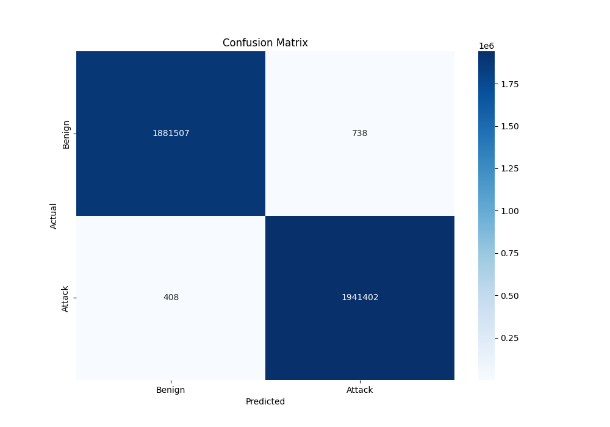

# MODC Project - Part III - Phase 5 & 8 - Machine Learning

Este projeto tem como objetivo classificar traces utilizando um modelo de Machine Learning treinado com RandomForest. Siga os passos abaixo para utilizar o projeto.

## Passo 1: Download do Dataset

Faça o download do dataset a partir do seguinte link: [Download ddos_balanced Dataset](https://www.kaggle.com/datasets/devendra416/ddos-datasets)

## Passo 2: Preparar o Dataset

1. Crie uma pasta chamada `dataset` na raiz do projeto.
2. Coloque o arquivo CSV do dataset dentro da pasta `dataset` com o nome `final_dataset.csv`.

## Passo 3: Treinar o Modelo

Para treinar o modelo, execute o script `train-model.py`:

```bash
python3 train-model.py
```

O melhor modelo será guardado dentro da pasta `saved_model`.

## Passo 4: Criar Novos Traces

Caso queira criar novos traces, siga os passos abaixo:

1. Vá até a pasta `dataset`.
2. Copie as linhas desejadas do arquivo `final_dataset.csv` e cole em um novo arquivo, por exemplo `raw_traces.csv`.

Para converter os traces de CSV para o formato reconhecido pelo modelo, execute:

```bash
python3 parse_traces.py raw_traces.csv
```

O arquivo `traces.txt` será criado com os valores que você escolheu.

## Passo 5: Classificar Traces

Após o modelo ser treinado e salvo, você pode classificar novos traces. Para isso, execute o comando abaixo:

```bash
python3 classify-traces.py traces.txt
```

## Dados ML

| Model                 | Precision (%) | Recall (%) | F1-Score (%) | Accuracy (%) |
|-----------------------|---------------|------------|--------------|--------------|
| Random Forest         | 99.977        | 99.960     | 99.969       | 99.969       |
| MLP                   | 99.321        | 98.382     | 98.849       | 98.872       |
| Gaussian Naive Bayes  | 91.461        | 61.984     | 73.891       | 78.439       |
| Regressão Logística   | 91.532        | 61.237     | 73.381       | 78.132       |



## Estrutura do Projeto

```
.
├── dataset
│   └── final_dataset.csv
├── saved_model
│   └── bestmodel_v3.sav
├── parse_traces.py
├── train-model.py
├── classify-traces.py
└── README.md
```

## FCUL - MEI - Grupo 11

- David Martins nº 62725
- Mariana Bento nº 53676
- Miguel Mota nº 62702

## Uso resumido

1. Baixe e prepare o dataset.
2. Treine o modelo com `train-model.py`.
3. Classifique os traces com `classify-traces.py`.
4. Crie e parse novos traces conforme necessário.